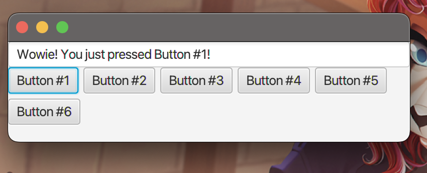
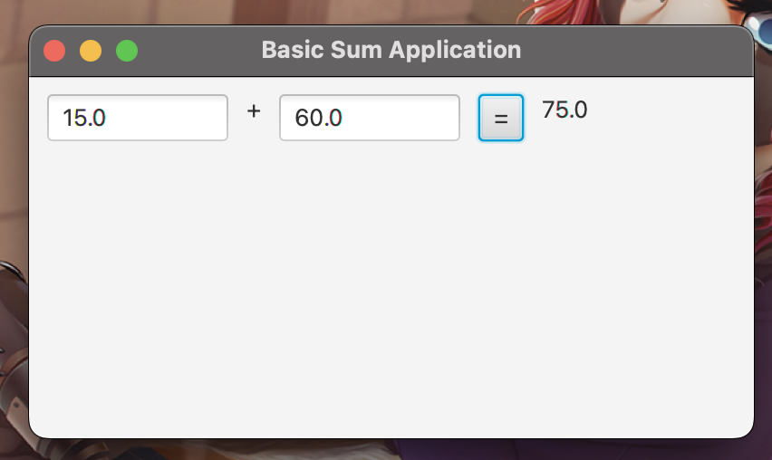
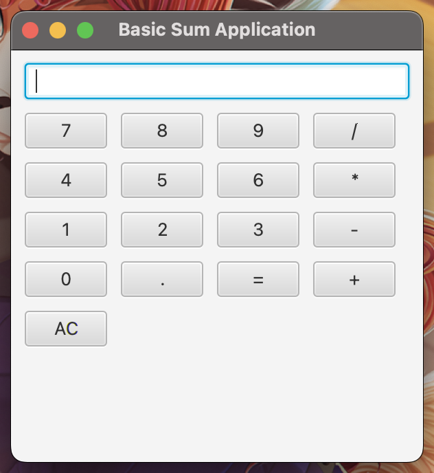
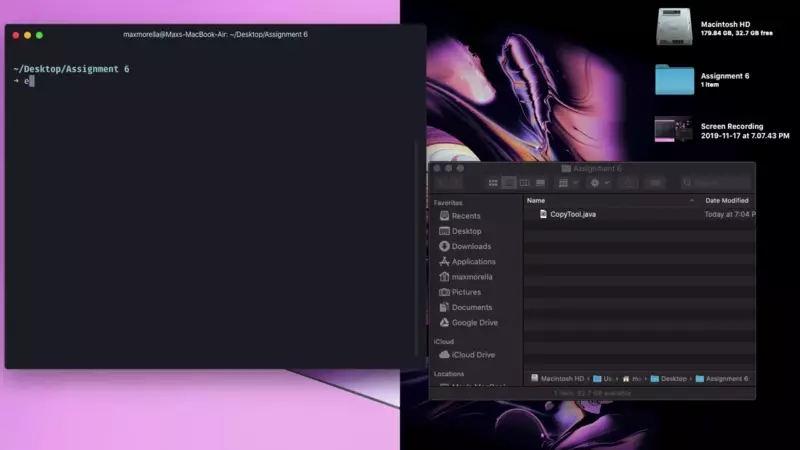

# cse-1322-programming-2

Code written for CSE 1322 / 1322L

Mae Morella - Fall 2019

## Disclaimer

This repository contains solutions to many homework and lab assignments, and should be used only for reference and educational purposes. Plagiarism or uncredited use of copied code is in violation of the College of Computing's policy, and is not condoned.

## Usage

This repository was written to be used from within an IDE like Intellij or Visual Studio Code. Compilation infrastructure. A JDK with bundled JavaFX, such as LibericaFX, is needed for GUI applications to run.

## Module 1 – Introduction
### Lab 1A – Array Operations

* [ArrayOperations](src/module1/introduction/arrayoperations/ArrayOperations.java)

A simple program that implements the following operations:

* `findLargest` – find the largest value in the given array
* `randomArray` – generate an array filled with random integer values
* `positiveStreamLength` – finds the length of the longest continuous sequence of positive integers.

#### Output
```txt
int[] nums = [1, 4, 13, 43, -25, 17, 22, -37, 29]
findLargest(nums) => 43

int[] data = [-84, -49, -38, -45, 23, 18, 0, 84, -10, 0, -23, 75, 51, 30, 53, -1, 0, -49, -19, 3]
findLargest(data) => 84
findLargest(nums) + findLargest(data) => 127
positiveStreakLength(data) == 4
```

### Lab 1B – Search

Implementations of the linear and binary search algorithms.

#### Output
* [LinearSearch](src/module1/introduction/searching/LinearSearch.java)
    ```
    nums[]: [1, 4, 4, 22, -5, 10, 21, -47, 23]
    linearSearchDemo(nums, 10): 
    Value 10 found at index [5]

    data[]: [10, 14, 13, 15, 18, 7, 6, 12, 18, 13, 12, 9, 0, 2, 13, 8, 15, 5, 1, 1]
    linearSearchDemo(data, 10): 
    Value 10 found at index [0]
    ```
* [BinarySearch](src/module1/introduction/searching/BinarySearch.java)
    ```
    nums[] : [1, 4, 4, 22, -5, 10, 21, -47, 23]
    binarySearch(nums, 10) => 5

    int[] data: [-10, -5, -4, -3, -3, -2, 0, 0, 1, 2, 2, 3, 4, 5, 5, 5, 8, 10, 10, 10]
    binarySearch(data, 10) => 18
    ```

### Assignment 1 – Report Card Manager
Program that calculates the average and letter grade for a set of students. 

* [Tests](src/module1/introduction/testmanager/Tests.java) – data object representing a set of five test scores
* [TestManager](src/module1/introduction/testmanager/TestManager.java) displays a set of students' test scores, and calculates the class average. 


#### Output
```
Name                      Scores               AVG   Grade
========================================================
Jack Johnson              85 83 77 91 76       82.0  B    
Lisa Aniston              80 90 95 93 48       81.0  B    
Andy Cooper               78 81 11 90 73       66.0  D    
Ravi Gupta                92 83 30 69 87       72.0  C    
Bonny Blair               23 45 96 38 59       52.0  F    
Danny Clark               60 85 45 39 67       59.0  F    
Samantha Kennedy          77 31 52 74 83       63.0  D    
Robin Bronson             93 94 89 77 97       90.0  A    
Sun Xie                   79 85 28 93 82       73.0  C    
Kiran Patel               85 72 49 75 63       68.0  D    
Class Average: 70
```

## Module 2 – Object-Oriented Programming
### Lab 2A – Inheritance
Implements a [Person](src/module2/oop/inheritance/Person.java) class. The  subclass [Employee](src/module2/oop/inheritance/Employee.java) represents an employee at a school, with its own subtypes [Faculty](src/module2/oop/inheritance/Faculty.java) and [Staff](src/module2/oop/inheritance/Staff.java). The [Main](src/module2/oop/inheritance/Main.java) class instantiates one of each, and calls their respective `display` method. 

#### Output
```txt
PERSON: John Egbert
Address: 999 Sample Street
Phone: 123-456-7890
Email: ectoBiologist@pesterchum.net

STUDENT: Dave Strider
Address: 420 Wicked Lane
Phone: 420-555-6969
Email: coolguy6969@radical.biz
Class Status: senior

EMPLOYEE: Terezi Pyrope
Address: 612 Alternia Drive
Phone: 413-612-0101
Email: g4llowsCallibrator@troll.ian
Hire Date: 2009-04-13
Salary: $612612
Office: Room BR34K-H34DS

FACULTY: Seymour Skinner
Address: 123 Springfield Lane
Phone: 789-555-8080
Email: steamed.hams@springfield.edu
Hire Date: 1989-12-17
Salary: $123,456
Office: Room H4-M5
Office Hours: MTWRF - 9am – 5pm
Rank: Principal

JANITOR: Scruffy the Janitor
Address: 4321 New New York
Phone: 555-555-5555
Email: scruffy.the.janitor@planetexpress.com
Hire Date: 3000-01-01
Salary: $12,345
Office: JC-3000
```

### Lab 2B – Abstract Classes
Implements [Octagon](src/module2/oop/abstracts/Octagon.java) class, as an implementation of the abstract [GeometricObject](src/module2/oop/abstracts/Octagon.java) class.  [OctagonDemo](src/module2/oop/abstracts/Octagon.java) demonstrates comparison between them.

#### Output

```
=== OCTAGON o1 ===
Edge length: 8.0
Area: 309.0
Perimeter: 64.0

=== OCTAGON o2 ===
Edge length: 8.0
Area: 309.0
Perimeter: 64.0

=== OCTAGON o3 (clone of o1) ===
Edge length: 8.0
Area: 309.0
Perimeter: 64.0

o3.equals(o1) => true
o3.compareTo(o2) => 1
```

### Assignment 2 – Vacation Price Calculator

Defines two classes, [InclusiveVacation](src/module2/oop/vacation/InclusiveVacation.java) and [PiecemealVacation](src/module2/oop/vacation/PiecemealVacation.java) which extend the abstract base [Vacation](src/module2/oop/vacation/Vacation.java). The [VacationsDemo](src/module2/oop/vacation/VacationsDemo.java) program takes user input, and calculates vacation price for each type.

#### Output
```
=== ALL-INCLUSIVE VACATION ===
DESTINATION: Honolulu
BRAND: Delta Vacations
RATING: ★★★★☆
BUDGET: $5,000.00
PRICE: $4,000.00
You have $1,000.00 leftover.

=== PIECEMEAL VACATION ===
DESTINATION: Italy
BUDGET: $4,500.00
ITEMS:
 • Airfare    $3,000.00 
 • Meals      $400.00   
 • Hotel      $600.00   
TOTAL PRICE:  $4,000.00 
You have $500.00 leftover.

=== CREATE YOUR OWN ALL-INCLUSIVE VACATION ===
Enter destination: 
ERROR: Input must not be empty
Enter destination: Shmoop
Enter budget: $1000
Enter price: $10000
Enter brand: Flagship Flights
Enter rating (0-5 stars): 5

=== USER GENERATED ALL-INCLUSIVE VACATION ===
DESTINATION: Hollywood
BRAND: Flagship Flights
RATING: ★★★★★
BUDGET: $1,000.00
PRICE: $10,000.00
You are $9,000.00 over budget!

=== CREATE YOUR OWN ALL-INCLUSIVE VACATION ===
Enter destination: aaa
Enter budget: $aaa
ERROR: input must be a valid double
Enter budget: $100
Enter item #1: 15 
Enter 15 price: $15
Press enter when finished
Enter item #2: Star Tour
Enter Star Tour price: $100
Press enter when finished
Enter item #3: Hotel        
Enter Hotel price: $
ERROR: input must be a valid double
Enter Hotel price: $30
Press enter when finished
Enter item #4: 

=== USER GENERATED PIECEMEAL VACATION ===
DESTINATION: Hollywood
BUDGET: $100.00
ITEMS:
 • Rental car $15.00    
 • Star Tour  $100.00   
 • Hotel      $30.00    
TOTAL PRICE:  $145.00   
You are $45.00 over budget!
```

## Module 3 – GUI Programming
### Lab 3A – Button App
Implements [ButtonApp](src/module3/gui/buttonapp/ButtonApp.java), a basic JavaFX program which displays a list of buttons, each of which gives a different result when pressed.




### Lab 3B – String App
Implements [StringApp](src/module3/gui/stringapp/StringApp.java), a basic JavaFX program that takes two numeric inputs and calculates their sum.




### Assignment 3 – Calculator App
Implements [CalculatorGUI](src/module3/gui/calculator/CalculatorGUI.java), a basic JavaFX calculator.



## Module 4 – Recursion
### Lab 4A – Vowel Counter

[VowelCounter](src/module4/recursion/vowelcounter/VowelCounter.java) counts the number of vowels (a-e-i-o-u) in a word or phrase.

#### Output

```
=== RECURSIVE VOWEL COUNTER DEMO ===
vowelCount("AIUEOaiueo") => 10
vowelCount("abab") => 2
vowelCount("queueing") => 5
vowelCount("buffalo") => 3
vowelCount("4BS0L6T3LY L33T") => 0
vowelCount("hachi machi") => 4
vowelCount("hOnK hOnK mOtHeRfAtHeR") => 6
vowelCount("bienvenue") => 5
vowelCount("power buttons") => 4
```

### Lab 4B – Palindrome Checker
[PalindromeChecker](src/module4/recursion/palindromes/PalindromeChecker.java) uses recursion to check whether a string (stripped of capitalization, spacing, and punctuation) is palindromic.

The [PalindromeCheckerTests](src/module4/recursion/palindromes/PalindromeCheckerTests.java) program validates that the palindrome checker works correctly.

#### Output
```
[✓] "" -> TRUE; expected TRUE
[✓] "a" -> TRUE; expected TRUE
[✓] "abca" -> FALSE; expected FALSE
[✓] "aloha ahola" -> TRUE; expected TRUE
[✓] "toy boat" -> FALSE; expected FALSE
[✓] "bananab" -> TRUE; expected TRUE
[✓] "abba" -> TRUE; expected TRUE
[✓] "atlanta" -> FALSE; expected FALSE
[✓] "Able was I, ere I saw Elba" -> TRUE; expected TRUE
[✓] "No 'x' in Nixon?" -> TRUE; expected TRUE
[✓] "Madam, I'm Adam." -> TRUE; expected TRUE
[✓] "This sentence is not a palindrome." -> FALSE; expected FALSE
[✓] "Was it a car or a cat I saw?" -> TRUE; expected TRUE
[✓] "Hello world" -> FALSE; expected FALSE
[✓] "Woh! OwO OwO. How?" -> TRUE; expected TRUE
[✓] "This isn't a palindrome" -> FALSE; expected FALSE
```

### Assignment 4
The [StringReverser](src/module4/recursion/recursion/StringReverser.java) class uses recursion to reverse a string.
```
Hello world!
!dlrow olleH
```

The [SumOfSums](src/module4/recursion/recursion/SumOfSums.java) class uses recursion to calculate a "sum of sums", found by adding together the value of an array element with every element after it, and repeating at the next index. Equals Σ(a0..n) + Σ(a1..an) + Σ(a2..n) ... Σ(n..n).

The [SumOfSumsTests](src/module4/recursion/recursion/SumOfSumsTests.java) program tests that this function works as intended.
```
TEST: sumOfSums([5, 18, 4, 7, 11]) -> 136
- expected 136 - returned 136 – 👍  Test passed!
TEST: sumOfSums([50, 19, 1, -49, 3, 99, 3, 21, 63]) -> 1260
- expected 1260 - returned 1260 – 👍  Test passed!
TEST: sumOfSums([]) -> 0
- expected 0 - returned 0 – 👍  Test passed!
TEST: sumOfSums([1]) -> 1
- expected 1 - returned 1 – 👍  Test passed!
TEST: sumOfSums([3, 2, 1]) -> 10
- expected 10 - returned 10 – 👍  Test passed!
```

## Module 5 – Data Structures
### Lab 5A – ArrayLists & LinkedLists
[ArrayListApp](src/module5/datastructures/lists/ArrayListApp.java) and [LinkedListApp](src/module5/datastructures/lists/LinkedListApp.java) are simple programs that read 10 inputs from the user and sum them.

```
Enter input #1: 1
[1] - SUM: 1
Enter input #2: 2
[1, 2] - SUM: 3
Enter input #3: 3
[1, 2, 3] - SUM: 6
Enter input #4: 4
[1, 2, 3, 4] - SUM: 10
Enter input #5: 5
[1, 2, 3, 4, 5] - SUM: 15
Enter input #6: 6
[1, 2, 3, 4, 5, 6] - SUM: 21
Enter input #7: 7
[1, 2, 3, 4, 5, 6, 7] - SUM: 28
Enter input #8: 8
[1, 2, 3, 4, 5, 6, 7, 8] - SUM: 36
Enter input #9: 9
[1, 2, 3, 4, 5, 6, 7, 8, 9] - SUM: 45
Enter input #10: 10
[1, 2, 3, 4, 5, 6, 7, 8, 9, 10] - SUM: 55
```

### Lab 5B – Stacks & Queues

[ClothingStack](src/module5/datastructures/stackqueue/ClothingStack.java) and [FoodQueue](src/module5/datastructures/stackqueue/FoodQueue.java) contain custom implementation of the Stack and Queue data type to store [Clothing](src/module5/datastructures/stackqueue/Clothing.java) and [Food](src/module5/datastructures/stackqueue/Food.java) objects.


[ClothingStackApp](src/module5/datastructures/stackqueue/ClothingStackApp.java) are [FoodQueueApp](src/module5/datastructures/stackqueue/FoodQueueApp.java) are CLI for managing their respective objects.

#### Output
```
=== STACK HAS 7/20 ITEMS ===
 ** red hoodie (machine-washable)
 * white dress shirt
 * black tuxedo
 * blue jeans
 * blue shirt (machine-washable)
 * white shirt (machine-washable)
 * red shirt (machine-washable)

Enter command (? for help): ?

=== COMMANDS LIST ===
? - Display help message
a - Add new Clothing to stack
p - Remove topmost Clothing item
f - Filter by color
w - Show only washable
r - Reset stack to empty

Enter command (? for help):
```

```
=== QUEUE WITH 3 / 5 ELEMENTS ===
 * Hot Dog - 300 calories per serving (1 servings)
 * Barbecue Lays - 120 calories per serving (4 servings)
 * Pringles - 130 calories per serving (10 servings)
AVG CALORIES: 183 per serving
Highest Calorie Food: Pringles (1300 total calories)

=== DEMO: ENQUEUE METHOD ===
ADD: Inserted "Pizza" at as the 4th food
ADD: Inserted "Diet Coke" at as the 5th food
ADD: Tried to insert "Jumbo Slushie", but queue can only hold 5 elements
=== QUEUE WITH 5 / 5 ELEMENTS ===
 * Hot Dog - 300 calories per serving (1 servings)
 * Barbecue Lays - 120 calories per serving (4 servings)
 * Pringles - 130 calories per serving (10 servings)
 * Pizza - 500 calories per serving (8 servings)
 * Diet Coke - 0 calories per serving (6 servings)
AVG CALORIES: 210 per serving
Highest Calorie Food: Pizza (4000 total calories)

=== DEMO: DEQUEUE METHOD ===
POP: Food #5: Hot Dog - 300 calories per serving (1 servings)
POP: Food #4: Barbecue Lays - 120 calories per serving (4 servings)
POP: Food #3: Pringles - 130 calories per serving (10 servings)
POP: Food #2: Pizza - 500 calories per serving (8 servings)
=== QUEUE WITH 1 / 5 ELEMENTS ===
 * Diet Coke - 0 calories per serving (6 servings)
AVG CALORIES: 0 per serving
Highest Calorie Food: Diet Coke (0 total calories)
```

### Assignment 5 – Bird Survey
Program that counts bird species sightings.

* [MyLinkedList](src/module5/datastructures/birdsurvey/MyLinkedList.java) – custom linked list implementation
* [BirdSpecies](src/module5/datastructures/birdsurvey/BirdSpecies.java) – a type of bird and amount of sightings
* [BirdSurvey](src/module5/datastructures/birdsurvey/BirdSurvey.java) – collection of BirdSpecies objects
* [BirdSurveyDemo](src/module5/datastructures/birdsurvey/BirdSurveyDemo.java) – records bird sightings

```
=== 5 SPECIES RECORDED SO FAR (0 TOTAL BIRDS) ===
 * wood duck            –  0 sightings
 * brown thrasher       –  0 sightings
 * barn owl             –  0 sightings
 * woodpecker           –  0 sightings
 * goldfinch            –  0 sightings

Enter species (q to exit): barn owl

You sighted a barn owl! (1 sightings total)

=== 5 SPECIES RECORDED SO FAR (1 TOTAL BIRDS) ===
 * wood duck            –  0 sightings
 * brown thrasher       –  0 sightings
 * barn owl             –  1 sightings
 * woodpecker           –  0 sightings
 * goldfinch            –  0 sightings

Enter species (q to exit): woodpecker

You sighted a woodpecker! (1 sightings total)

=== 5 SPECIES RECORDED SO FAR (2 TOTAL BIRDS) ===
 * wood duck            –  0 sightings
 * brown thrasher       –  0 sightings
 * barn owl             –  1 sightings
 * woodpecker           –  1 sightings
 * goldfinch            –  0 sightings

Enter species (q to exit): 
```

## Module 6 – IO and Exception-handling
### Lab 6A – Time converter

* [Time](src/module6/exceptions_and_io/timeexception/Time.java) – converts from 24hr to 12hr time format. Throws [TimeFormatException](src/module6/exceptions_and_io/timeexception/TimeFormatException.java) on error.
* [TimeConverterApp](src/module6/exceptions_and_io/timeexception/TimeConverterApp.java) – takes user input.

```
===================================================
|                                                 |
|           24-HOUR TIME CONVERTER APP            |
|                                                 |
===================================================

Enter time in 24-hour notation: 18:00
That is the same as 06:00 PM

Enter time in 24-hour notation ('q' to exit): 25:00
Error: 25:00 is out of bounds [00:00–23:59]

Enter time in 24-hour notation ('q' to exit): 1200
Error: time must be in the format "xx:xx"

Enter time in 24-hour notation ('q' to exit): 
```

### Lab 6B – Text editor app
[TextEditorApp](src/module6/exceptions_and_io/texteditorapp/TextEditorApp.java) is a small program that can load and save text files.


### Assignment 6 – File copy app
[CopyTool](src/module6/exceptions_and_io/filecopierapp/CopyTool.java) is a simple program that can copy text files between paths.



```
Enter path to source file (ex. "./textfile.txt"): textfile.txt
=== textfile.txt ===
1  : hi

Enter path to destination (ex. "./textfile2.txt"): textfile2.txt
Successfully wrote to textfile2.txt
```

## Module 7 – Parallelism
### Lab 7A – Concurrent sum
[ConcurrentSum](src/module7/parallelism/sum/ConcurrentSum.java) implements an algorithm to calculate the sum of a large array, by splitting the array into subarrays shared between three threads.

[ConcurrentSumTest](src/module7/parallelism/sum/ConcurrentSumTest.java) runs a benchmark comparing this algorithm to the linear version.

```
==== MULTITHREADING TESTS (ARRAY SIZE: 100,000,000 - BOUND: 10) ====

===== TRIAL #1 =====
  ARRAY LENGTH: 100,000,000 (took 3,552 ms)
    LINEAR SUM: 500,001,995 (in 65 ms)
CONCURRENT SUM: 500,001,995 (in 22 ms)

===== TRIAL #2 =====
  ARRAY LENGTH: 100,000,000 (took 3,422 ms)
    LINEAR SUM: 499,968,113 (in 63 ms)
CONCURRENT SUM: 499,968,113 (in 23 ms)

===== TRIAL #3 =====
  ARRAY LENGTH: 100,000,000 (took 3,173 ms)
    LINEAR SUM: 500,029,840 (in 64 ms)
CONCURRENT SUM: 500,029,840 (in 22 ms)

===== TRIAL #4 =====
  ARRAY LENGTH: 100,000,000 (took 3,364 ms)
    LINEAR SUM: 500,010,859 (in 64 ms)
CONCURRENT SUM: 500,010,859 (in 22 ms)

===== TRIAL #5 =====
  ARRAY LENGTH: 100,000,000 (took 3,593 ms)
    LINEAR SUM: 500,021,344 (in 64 ms)
CONCURRENT SUM: 500,021,344 (in 23 ms)

===== TRIAL #6 =====
  ARRAY LENGTH: 100,000,000 (took 5,021 ms)
    LINEAR SUM: 500,038,609 (in 64 ms)
CONCURRENT SUM: 500,038,609 (in 23 ms)

===== TRIAL #7 =====
  ARRAY LENGTH: 100,000,000 (took 4,523 ms)
    LINEAR SUM: 500,038,084 (in 65 ms)
CONCURRENT SUM: 500,038,084 (in 23 ms)

===== TRIAL #8 =====
  ARRAY LENGTH: 100,000,000 (took 4,569 ms)
    LINEAR SUM: 499,960,948 (in 64 ms)
CONCURRENT SUM: 499,960,948 (in 22 ms)

===== TRIAL #9 =====
  ARRAY LENGTH: 100,000,000 (took 5,452 ms)
    LINEAR SUM: 500,061,900 (in 64 ms)
CONCURRENT SUM: 500,061,900 (in 22 ms)

===== TRIAL #10 =====
  ARRAY LENGTH: 100,000,000 (took 5,012 ms)
    LINEAR SUM: 499,945,444 (in 64 ms)
CONCURRENT SUM: 499,945,444 (in 23 ms)
```

### Lab 7B – Concurrent word counter
[WordCounter](src/module7/parallelism/wordcounter/WordCounter.java) reads the file `alice.txt` (containing the fulltext of *Alice in Wonderland*), and concurrently counts instances of the word "the".

```
                ALICE'S ADVENTURES IN WONDERLAND

                          Lewis Carroll
...
remembering her own child-life, and the happy summer days.

                             THE END

=== PARALLEL COUNT (8 THREADS) ===
alice.txt has 2306 occurences of "the". (took 4 ms)
=== SERIAL COUNT ===
alice.txt has 2306 occurences of "the". (took 1 ms)
```


### Assignment 7 – Concurrent bubble sort
* [BubbleSort](src/module7/parallelism/bubblesort/BubbleSort.java)
* [BubbleSortTest](src/module7/parallelism/bubblesort/BubbleSortTest.java)